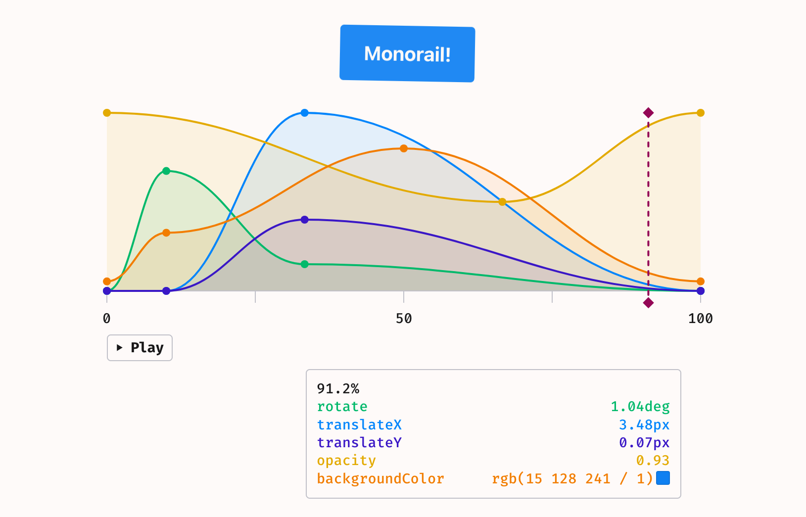

# Monorail

Turn any CSS keyframe animation into an interactive graph.



You probably need this about as much as [Springfield needed their Monorail](https://en.wikipedia.org/wiki/Marge_vs._the_Monorail) - therefore the name. If you haven't seen that Simpsons episode, I wholeheartedly recommend it.

If you find it useful for animation debugging or breaking down complex animations, please let me know. I would love to see it in action.

## What it does

- Visualizes most single-value numerical CSS properties in the animation (1)
- Extracts `transform` and `filter` methods and displays them separately
- Supports a bunch of color-related properties
- Shows easing curves between keyframes
- Auto-scales each property's values so everything fits in one view
- Drag the timeline to seek through the animation
- Responsive layout with light/dark mode and handpicked colors

(1): It supports all numerical properties with a single value. This means `translate(10px, 10px)` won't be picked up, but both `translateX(10px)` and `translateY(10px)` will.

## Why?

I needed a single graph for a blog post I was writing. Instead of drawing an SVG by hand, I decided to try making a script to generate it. It turned out to be way more complicated than I expected, with lots of edge cases. But it is an interesting problem and I got dragged down the rabbit hole. I ended up with a library that can visualize any CSS keyframe animation. Probably useless for most people, but I had fun making it.

## Limitations

- If you mix and match units for a single property (e.g., `em` and `px`), the animation curve won't be calculated correctly
- `calc` and `var` are not supported
- The information tooltip might be misaligned after resizing the window

## Wishlist (maybe someday)

Here are some features that would be nice to have, though I'm not sure if I'll ever implement them:

- Showing start and end values for each curve
- Add support for more complicated properties (e.g. drop-shadow)
- Option to render all properties stacked vertically
- Support for mixing units by converting everything to `px`
- Ability to drag the nodes to update the actual animation
- Make [a custom event](./src/lib/on-animation-time-update.ts) to track the current time in the animation and update the graph real-time

## Supported properties

As mentioned above, only properties with a single numerical value are supported. Additionally, the library parses `transform`, `filter`, and some color properties separately. Here's a list of supported special cases:

### Color properties

```
color
backgroundColor
borderColor
borderTopColor
borderRightColor
borderBottomColor
borderLeftColor
columnRuleColor
outlineColor
textDecorationColor
textEmphasisColor
textFillColor
textStrokeColor
fill
stroke
```

### Transform methods

```
rotate
rotateX
rotateY
rotateZ
translateX
translateY
translateZ
scale
scaleX
scaleY
scaleZ
skew
skewX
skewY
```

### Filter methods

```
blur
brightness
contrast
grayscale
hue-rotate
invert
opacity
saturate
sepia
```
